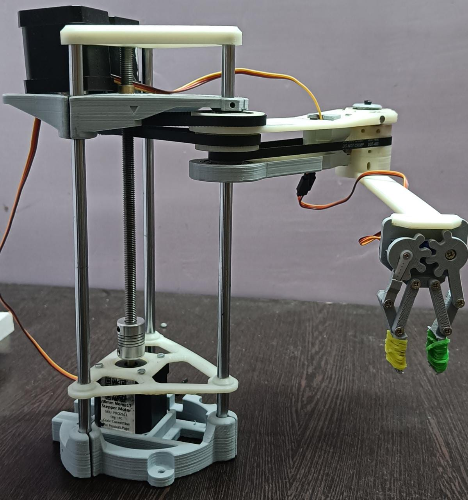
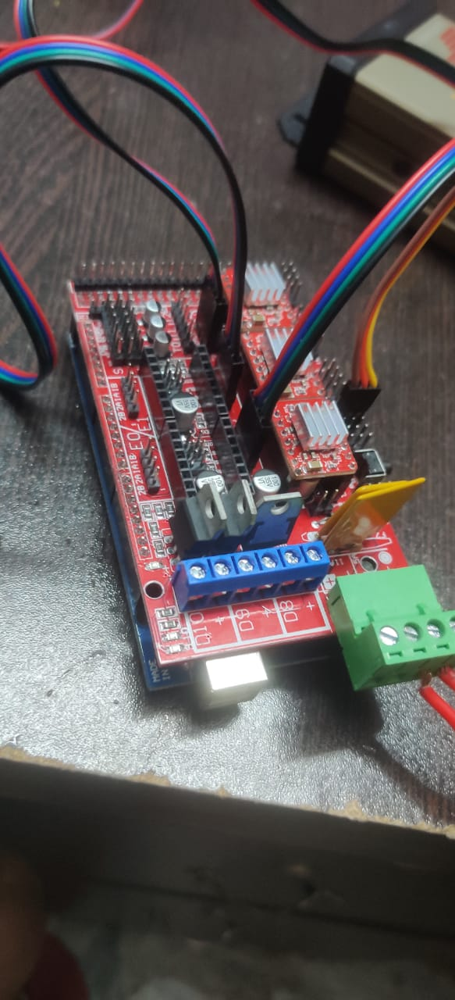
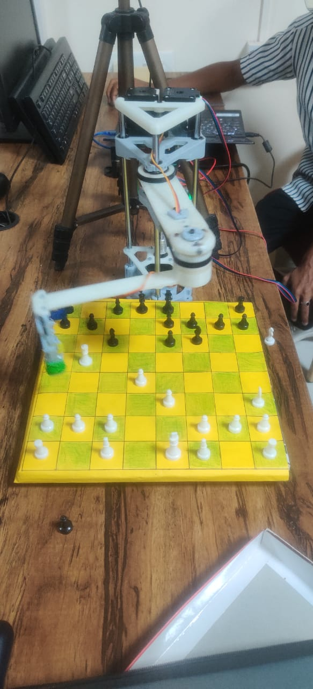

--Developed an Al-Enabled robotic Scara arm capable of playing chess. --Successfully demonstrated the robot's ability to play chess against human. https://youtu.be/caFh0R7WLhY?si=xEmHja3Sfm7iujAI
# AI-Enabled Chess Robot (Python + Stockfish + Ramps 1.4)

An autonomous chess-playing robotic arm built with **Python**, powered by **Stockfish** for chess intelligence, and driven by a **Ramps 1.4** controller for precise stepper motor control. Developed using **Thonny IDE** for rapid testing and deployment. 
---

##  Project Showcase

<div align="center">
  
  
  
</div>

---

##  Key Features
- **Intelligent Game Logic**: Stockfish engine evaluates chess positions and selects optimal moves.
- **Robotic Actuation**: Ramps 1.4 + stepper motors translate decisions into physical chess piece movements.
- **Developer-Friendly IDE**: Full setup using **Thonny**—great for debugging and iterative development.
- **Modular Code**: Clean separation between game logic, engine interface, and motor control modules.

---

##  System Workflow

```text
[ Thonny Python App ]
         │
         ▼
[ Stockfish Engine ] → Evaluates chess board → Sends best move
         │
         ▼
[ Motor Controller (Ramps 1.4) ] → Drives robot arm via stepper motors → Executes move physically

Quick Start Guide
1. Clone the Repo
git clone https://github.com/Bhargav1026/AI-enabled-Chess-Robot.git
cd AI-enabled-Chess-Robot

2. Install Dependencies

Launch Thonny or use command line:

pip install stockfish
# Add additional packages if required, e.g.:
# pip install pyserial RPi.GPIO

3. Hardware Setup

Connect the Ramps 1.4 board to an Arduino or your control board.

Attach stepper motors to the robot arm joints.

Calibrate movement limits and ensure safe arm travel across the chessboard.

Place the chessboard within arm’s reachable workspace.

4. Launch the Application

Open your main controller script (e.g., main.py) in Thonny and run:

python main.py


The robot will compute its move using Stockfish, then move the chess piece using the Ramps-controlled arm.

Module Breakdown
Script / Module	Description
main.py	Core orchestration (game loop, move decisions)
stockfish_interface.py	Interacts with Stockfish engine
motor_controller.py	Sends commands to Ramps 1.4 for stepper control
utils.py	Helper functions (board mapping, logging, etc.)
Future Enhancements

Human Move Input Detection: Integrate camera + OpenCV to detect and respond to human moves.

Web Dashboard: Monitor game state, logs, and arm status via a browser interface.

Voice Feedback: Use text-to-speech (e.g., say “My move is e4”) for an engaging experience.

Improved Motion Control: Add smoothing, inverse kinematics, or path planning for fluid arm movement.

Why It Shines

Combines AI chess logic with real-world robotics—a standout in technical portfolio presentations.

Developed using a debugger-friendly environment (Thonny), perfect for showcasing development skills.

Blends software and hardware mastery—ideal for roles in robotics, embedded systems, or AI-driven hardware.

License & Author

MIT License © 2023 Gunapu Bhargava
